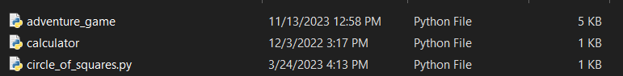

# 🐍 My Python Journey

Welcome to my Python repository! This is a curated collection of my early Python scripts, showcasing the foundation of my programming logic, problem-solving skills, and creative coding. 

---

## 📂 Projects Overview

### 1. 🧮 Terminal Calculator
* **File:** `calculator.py`
* **Original Creation Date:** December 3, 2022
* **Description:** A clean, function-based terminal calculator that handles basic arithmetic operations (`+`, `-`, `*`, `/`) and features a secondary logic to check if the final output is an even or odd number.

### 2. 🎨 Turtle Circle of Squares
* **File:** `circle_of_squares.py`
* **Original Creation Date:** March 24, 2023
* **Description:** A creative visual script using Python's `turtle` graphics framework. It loops complex square iterations at maximum execution speed to render a beautiful, geometric circular art piece.

### 3. 🎮 Jungle Text Adventure Game
* **File:** `adventure_game.py`
* **Original Creation Date:** November 13, 2023
* **Description:** A text-based choice-driven adventure game where players navigate a mysterious jungle filled with hidden weapons, risky paths (like a dark wolf-infested cave), and a final showdown with a terrifying creature. Uses Python's `random` module for weapon assignment and custom functions for path branching.

---
## 📸 Historical Timeline Proof
Here is a screenshot from the local machine showing the original creation dates of these files back in late 2022 and early 2023, before the recent UI updates:

